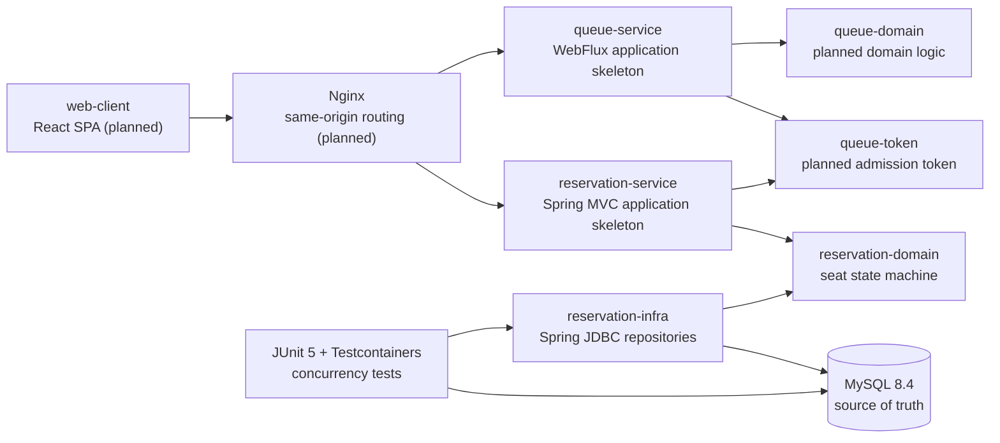

# RailGate

[](https://github.com/whdkfhr/rail-gate/actions/workflows/gradle-check.yml)

명절 기차표 예매처럼 짧은 시간에 요청이 집중되는 환경에서 **공정한 입장**과
**좌석 정합성**을 어떻게 보장할지 구현하고 검증하는 학습 프로젝트입니다.

실제 예매 시스템을 우회하거나 자동화하는 도구가 아닙니다. 기능 수를 빠르게 늘리기보다,
동시성 문제를 재현하고 불변식과 테스트로 설계의 근거를 남기는 데 초점을 둡니다.

> 현재 상태: 좌석 선점, 결제 전이, 만료, 해제의 동시성 코어를 구현했습니다.
> REST API와 애플리케이션 배선, 사용자 웹, 대기열, PG 연동은 아직 개발 중입니다.

## Why RailGate?

명절 예매 시스템에는 서로 다른 성격의 문제가 동시에 존재합니다.

- 순간적으로 몰리는 사용자를 순서대로 입장시켜야 합니다.
- 한 좌석은 아무리 많은 요청이 경쟁해도 한 예약에만 귀속되어야 합니다.
- 여러 좌석은 일부만 잡히지 않고 전부 성공하거나 전부 실패해야 합니다.
- 타임아웃, 재시도, 만료 처리가 발생해도 돈과 좌석 상태가 어긋나면 안 됩니다.

RailGate는 이 문제를 단순 CRUD가 아닌 **불변식 중심 설계**, **DB 동시성 제어**,
**결정적 경합 테스트**로 풀어보며 트레이드오프를 학습하기 위해 시작했습니다.

## Current Scope

| 영역 | 상태 | 현재 구현 |
|---|---|---|
| 좌석 도메인 | 완료 | 순수 Java 상태 머신, 값 객체, 복원 시 불변식 검증 |
| 단일 좌석 선점·확정 | 완료 | 조건부 `UPDATE`와 `affected_rows` 기반 성공 판정 |
| 다좌석 선점 | 완료 | 단일 벌크 `UPDATE`, 전부 성공 또는 전부 롤백 |
| 만료·자발적 해제 | 완료 | stale 후보 격리, 상태와 `hold_id`를 함께 검증하는 CAS |
| 트랜잭션 경계 | 완료 | 외부 트랜잭션 참여, NESTED savepoint로 저장소 로컬 원자성 보장 |
| 사용자별 선점 상한 | 실험 중 | **범위를 판매 이벤트 단위로 결정.** 경쟁 조건·잠금 순서·만료 귀속 실험 완료. **migration·앱 배선은 미구현** |
| 판매 회차·운행편 도메인 | 진행 중 | `SaleEvent` 상태 전이표(허용 2 / 거부 4)와 `TrainSchedule`의 인스턴스 불변을 순수 도메인으로 구현. **테이블·저장소·영속 소속 변경 방지는 미구현** |
| 판매 회차 운영 스키마 | 실험 완료 | 정규화 조회를 실제 MySQL 실행 계획으로 확정하고, 소속 변경 방어 수단과 migration 순서를 결정. **V4 migration은 미적용** |
| 애플리케이션 API | 예정 | 유스케이스, 포트, REST API, 멱등키 저장소 배선 |
| 사용자 웹 | 설계 완료 | 검색·대기열·좌석·홀드·결제·예매 내역 화면과 상태·테스트 계약 정의. **코드는 미구현** |
| 대기열·결제·운영 | 예정 | Redis 대기열, 입장 토큰, Mock PG, 관측성, 부하 테스트 |

구현 여부와 목표 설계를 혼동하지 않도록, 아직 코드에 없는 기술과 기능은 로드맵으로
분리합니다. 상세 요구사항과 불변식의 현재 정의는 [`docs`](docs)에서 확인할 수 있습니다.

## Architecture

현재 저장소는 실행 애플리케이션과 재사용 가능한 도메인·인프라 모듈을 분리한
Gradle 멀티 모듈 구조입니다.



의존 방향은 `apps -> modules`, `infra -> domain`으로 제한합니다. 도메인 모듈에는
Spring, JPA, JDBC 의존성을 두지 않으며 이 규칙은 Gradle 검증 태스크에서도 검사합니다.

## Engineering Practices

### TDD: 실패를 먼저 재현하고 방어 코드를 추가

모든 코드를 형식적으로 TDD로 작성했다고 주장하지는 않습니다. 대신 정합성에 영향을 주는
핵심 경로에서는 다음 Red-Green-Refactor 루프를 지킵니다.

| 단계 | RailGate에서의 적용 |
|---|---|
| Red | 테스트 전용 순진한 구현으로 경쟁 조건과 부분 갱신을 먼저 재현 |
| Green | 조건부 `UPDATE`, 벌크 갱신, savepoint 등 가장 작은 방어를 추가 |
| Refactor | 값 객체·도메인 예외·정책 객체로 의도를 정리하고 중복 제거 |
| Record | 실험 조건, 결과, 선택 근거와 남은 위험을 `docs/experiments`에 기록 |

동시성 테스트도 우연한 타이밍에 기대지 않습니다. `CyclicBarrier`와
`CountDownLatch`로 실패 인터리빙을 고정하고, 같은 조건에서 순진한 구현은 실패하며
운영 구현은 통과하는지 비교합니다. 그래서 테스트가 단순 회귀 방지를 넘어
“현재 방어 코드가 무엇을 막고 있는가”까지 설명하도록 했습니다.

### DDD: 불변식과 도메인 언어를 코드의 중심에 배치

- **Bounded Context 분리**: Queue와 Reservation을 별도 모듈로 나누고 서로의 도메인
  타입을 직접 참조하지 않도록 의존 방향을 제한했습니다.
- **Ubiquitous Language 사용**: `Seat`, `HoldId`, `SeatStatus`, `SeatHoldPolicy`,
  `SaleEvent`처럼 요구사항의 용어를 클래스와 메서드 이름에 그대로 사용합니다.
  일반적인 `EventId` 대신 `SaleEventId`를 쓴 것도 도메인 이벤트·Kafka 이벤트·대기열
  이벤트와 구분하기 위한 선택입니다.
- **도메인 순수성 유지**: `reservation-domain`은 Spring이나 JDBC 없이 상태 전이와
  비즈니스 규칙만 표현하며, 실제 DB 원자성은 `reservation-infra`가 담당합니다.
- **불변식 우선 설계**: 기능 목록보다 I-8~I-14 같은 불변식을 먼저 정의하고, 구현과
  테스트가 어떤 불변식을 지키는지 추적합니다.

현재 DDD 적용은 좌석 도메인과 모듈 경계에 집중되어 있습니다. 애플리케이션 서비스와
포트 인터페이스는 아직 추출되지 않았으며, REST API 배선 단계에서 완성할 예정입니다.

### OOP: 상태를 가진 객체에 행위를 맡기고 잘못된 상태를 차단

- `Seat`는 상태를 외부 setter로 변경하지 않고 `hold`, `startPayment`, `confirm`,
  `release`, `expire` 같은 도메인 행위로만 전이합니다.
- `HoldId`, `UserId`, `SeatId`, `SeatCount`는 원시값을 감싼 불변 값 객체이며,
  생성 시점에 형식과 범위를 검증합니다.
- 한 좌석이 판단할 수 없는 다좌석 전부-또는-전무 규칙은 `SeatHoldPolicy`라는 도메인
  서비스로 분리했습니다.
- 상태 전이 위반과 소유권 위반을 전용 도메인 예외로 표현해 기술 예외나 HTTP 상태가
  도메인 모델로 새어 들어오지 않게 했습니다.
- DB 스냅샷 복원 시에도 상태와 필드 조합을 검증해 잘못된 객체가 메모리에 존재하지
  못하도록 합니다.

즉 도메인 객체는 규칙을 **표현**하고, JDBC 저장소는 경쟁 상황에서도 그 규칙을
**강제**합니다. 객체 내부의 캡슐화만으로는 프로세스 간 동시성을 보장할 수 없다는 경계를
명확히 구분했습니다.

## Problems and Solutions

개발 과정에서 정상 경로만 구현하지 않고, 먼저 깨지는 구현과 위험한 트랜잭션 조합을
테스트로 만들었습니다.

| 발견한 문제 | 실제로 관측한 결과 | 해결 방법 |
|---|---|---|
| `SELECT`로 확인한 뒤 `UPDATE` | 8명이 모두 성공 응답을 받았지만 DB의 실제 보유자는 1명 | 상태 조건을 포함한 단일 `UPDATE`와 `affected_rows`로 판정 |
| 좌석별 개별 `UPDATE` 반복 | 중간 좌석 경합 시 실패한 요청의 일부 좌석이 `HELD`로 잔류 | 단일 벌크 `UPDATE` 후 요청 수와 변경 행 수가 다르면 롤백 |
| 조회한 좌석 ID만 믿고 만료·해제 | 조회 후 확정되거나 재선점된 좌석까지 `AVAILABLE`로 되돌릴 수 있음 | `status`, `hold_id`, `expires_at`을 함께 비교하는 CAS로 stale 후보 거부 |
| 저장소 내부 `setRollbackOnly()` | 외부 트랜잭션 참여 시 정상적인 경합이 커밋 시점의 `UnexpectedRollbackException`으로 변경 | 최상위 경계는 호출자가 소유하고, 저장소 변경만 NESTED savepoint로 롤백한 뒤 전용 예외 전파 |
| 선점 상한의 범위를 운행편으로 잡음 | 같은 판매 회차인데도 운행편마다 카운터가 분리되어 상한 4석이 6석·8석으로 우회됨 | 범위를 판매 회차(`sale_event_id`) 단위로 확정하고, `TrainSchedule` 도메인 객체에 공개 재배정 API를 두지 않음. **영속 소속 변경의 최종 방어는 운영 스키마·저장소 단계에 남아 있음** |
| 외래 키가 있으니 소속도 불변일 것이라 가정 | 존재하는 다른 판매 회차로의 `UPDATE`가 그대로 성공. 이미 쌓인 quota가 어느 회차 것인지 되짚을 수 없게 됨 | 외래 키의 보장 범위를 "유효한 참조"로 한정하고, `UPDATE` 차단은 트리거·권한 회수 등 별도 층으로 분리해 각 층이 막는 것과 못 막는 것을 문서화 |

특히 `setRollbackOnly()` 문제는 단독 저장소 테스트에서는 드러나지 않고 외부 트랜잭션에
참여할 때만 발생했습니다. 호출자가 예외를 트랜잭션 안에서 잡더라도 부분 선점이 남지 않도록
savepoint 범위를 저장소의 벌크 갱신으로 제한했고, 서로 다른 `DataSource`가 연결되면 생성
시점에 거부하도록 배선 계약도 추가했습니다.

각 문제의 재현 코드, 대안 비교와 남은 한계는
[`TASK-002A`](docs/experiments/TASK-002A-seat-hold-race.md),
[`TASK-002C`](docs/experiments/TASK-002C-multi-seat-atomic-hold.md),
[`TASK-002D`](docs/experiments/TASK-002D-seat-expiry-sweeper.md),
[`TASK-002F`](docs/experiments/TASK-002F-transaction-boundary.md)에 남겨두었습니다.

## Key Decisions

### 1. MySQL을 좌석 정합성의 최종 방어선으로 사용

좌석 상태를 먼저 조회한 뒤 갱신하는 check-then-act 방식은 요청 사이에 다른 트랜잭션이
끼어들 수 있습니다. RailGate는 상태와 소유권을 `WHERE` 절에서 함께 검사하는 조건부
`UPDATE`를 사용하고, `affected_rows`만을 성공 여부의 기준으로 삼습니다.

```sql
UPDATE seat_inventory
   SET status = 'HELD', hold_id = :holdId, held_by = :userId
 WHERE id = :seatId
   AND status = 'AVAILABLE';
```

Redis 분산 락이나 애플리케이션 객체의 락에 좌석 정합성을 맡기지 않습니다. MySQL만
살아 있어도 한 좌석이 두 번 확정되지 않는 구조를 목표로 합니다.

### 2. 다좌석 요청은 단일 벌크 갱신으로 처리

좌석별 반복 갱신은 중간 실패 시 부분 선점을 남길 수 있습니다. 요청 좌석 ID를 정렬한 뒤
한 번의 벌크 `UPDATE`로 변경하고, 변경된 행 수가 요청 수와 다르면 savepoint까지
롤백합니다. 이 방식은 원자성과 일관된 잠금 순서를 함께 확보합니다.

### 3. 동시성 경로에는 Spring JDBC를 선택

좌석 전이의 핵심은 어떤 SQL이 실행되고 몇 행이 바뀌었는지 명확히 통제하는 것입니다.
따라서 dirty checking으로 SQL과 갱신 시점이 간접화되는 JPA 대신 Spring JDBC를
사용했습니다. 이는 JPA 자체를 배제하기 위한 결정이 아니라, 정합성 핵심 경로의 의도를
코드와 SQL에 그대로 드러내기 위한 선택입니다.

### 4. 되돌리기 어려운 스키마 결정은 실행 계획으로 판단

좌석에서 판매 회차를 얻을 때 조인을 한 번 더 할지, 좌석 행에 회차 식별자를 복제할지는
한번 정하면 되돌리기 어렵습니다. "조인이 하나 더 있다"는 직관 대신 실제 MySQL 8.4에서
실행 계획과 스토리지 엔진이 읽은 행 수를 측정했습니다.

좌석 60,000행 기준으로 조인 쪽은 `eq_ref`/PRIMARY였고, 읽은 행 수는 요청 좌석 수에
갇혀 있었습니다(4석 최악 12행). 좌석을 400행에서 60,000행으로 150배 늘려도 읽는 행 수가
늘지 않아 비정규화의 근거가 성립하지 않는다고 판단했습니다. 대신 정규화가 요청당 최대
6행을 더 읽는다는 사실은 그대로 기록했습니다.

실행 시간은 판단 근거로 쓰지 않았습니다. CI 머신 부하와 버퍼 풀 상태에 좌우되기 때문입니다.

### 5. 실제 MySQL에서 경합을 검증

인메모리 DB는 InnoDB의 행 잠금과 격리 동작을 대신 증명할 수 없습니다. 통합 테스트는
Testcontainers로 MySQL 8.4를 실행하며, `CountDownLatch`와 `CyclicBarrier`로 경쟁
시점을 통제합니다. 시간에 기대는 `Thread.sleep()` 대신 재현 가능한 인터리빙을 만듭니다.

## Tech Stack

| 기술 | 사용 이유 |
|---|---|
| Java 21 | 최신 LTS 기반의 명확한 타입 모델과 안정적인 동시성 도구 사용 |
| Spring Boot 4.1 | 실행 애플리케이션 구성과 테스트·관측 생태계 활용 |
| Gradle 9.6.1, Kotlin DSL | 멀티 모듈 경계와 의존성 규칙을 빌드에서 관리 |
| Spring JDBC | 조건부 SQL과 `affected_rows`, 트랜잭션 경계를 직접 제어 |
| MySQL 8.4, InnoDB | 행 잠금과 조건부 갱신을 이용한 좌석 정합성 보장 |
| Flyway | 스키마와 인덱스 변경 이력을 코드와 함께 버전 관리 |
| JUnit 5, AssertJ | 도메인 규칙과 실패 결과를 읽기 쉬운 테스트로 표현 |
| Testcontainers | 운영 DB와 같은 엔진에서 동시성·트랜잭션 동작 검증 |
| GitHub Actions | 모든 PR과 `main` 푸시에서 `./gradlew check` 자동 실행 |

사용자 웹은 TypeScript, React, Vite, React Router, TanStack Query를 기본 구성으로 하고
MSW, Vitest, React Testing Library, Playwright로 상태와 전체 흐름을 검증할 계획입니다.
선택 근거와 화면별 계약은 [`docs/FRONTEND.md`](docs/FRONTEND.md)에 정리했습니다.

Redis, Kafka, Prometheus, Grafana, k6는 목표 아키텍처에 포함되어 있지만 아직 구현하지
않았습니다. 필요한 단계에서 실험과 측정 근거를 만든 뒤 도입할 예정입니다.

## Verification Strategy

RailGate는 “부하 테스트에서 우연히 오류가 없었다”를 정합성의 증명으로 보지 않습니다.
각 핵심 불변식은 다음 세 층으로 확인합니다.

1. **구조적 논증**: InnoDB 행 잠금과 조건부 `UPDATE`가 왜 중복 전이를 막는지 설명합니다.
2. **결정적 검증**: barrier와 latch로 충돌 순서를 만들어 반복 테스트합니다.
3. **통계적 검증**: 이후 부하 테스트와 사후 정합성 쿼리로 위반 여부를 관찰합니다.

각 작업의 가설, 실패 재현, 선택한 해결책과 남은 위험은
[`docs/experiments`](docs/experiments)에 기록합니다.

## Project Structure

```text
rail-gate/
├── apps/
│   ├── queue-service/          # 대기열 애플리케이션 골격
│   ├── reservation-service/    # 예매 애플리케이션 골격
│   └── web-client/             # React 사용자 웹 (계획)
├── modules/
│   ├── common/                 # 최소 공용 타입
│   ├── queue-domain/           # 대기열 도메인 예정
│   ├── queue-token/            # 입장 토큰 예정
│   ├── reservation-domain/     # 좌석 상태 머신과 값 객체
│   └── reservation-infra/      # JDBC 저장소, Flyway, MySQL 통합 테스트
└── docs/
    ├── REQUIREMENTS.md         # 기능·비기능 요구사항
    ├── INVARIANTS.md           # 시스템 불변식과 검증 방법
    ├── ARCHITECTURE.md         # 목표 아키텍처와 의존 규칙
    ├── FRONTEND.md             # 사용자 웹 범위·상태·기술·테스트 계약
    ├── DEVELOPMENT_GUIDE.md    # 개발·테스트 규칙
    └── experiments/            # 작업별 가설과 실험 결과
```

## Run Tests

### Prerequisites

- Docker가 실행 중인 환경
- Java 21 또는 Gradle toolchain을 내려받을 수 있는 환경

```bash
./gradlew check
```

이 명령은 단위·통합 테스트와 모듈 의존 방향, 도메인 순수성 규칙을 함께 검증합니다.
Testcontainers 통합 테스트 때문에 Docker가 필요합니다. 아직 서비스 간 유스케이스 배선과
외부 API가 완성되지 않아, 현재는 전체 애플리케이션 실행보다 테스트가 주된 실행 진입점입니다.

## Roadmap

1. 결정된 판매 회차·운행편 스키마의 migration 적용과 사용자별 선점 상한의 세 이탈 경로(확정·만료·해제) 연동
2. 애플리케이션 서비스와 포트, REST API, 멱등키 저장소 구성
3. React 사용자 웹 골격과 MSW 기반 검색·좌석·홀드·결제 화면 구현
4. Redis Lua 기반 대기열과 서명된 입장 토큰, SSE 및 대기열 화면 연동
5. Mock PG의 authorize/capture 흐름과 결제 화면·실패 복구 연동
6. Playwright 전체 예매 E2E와 포트폴리오 스크린샷·시연 자료 구성
7. Prometheus·Grafana 관측성, k6 부하 테스트, 정합성 검증 자동화
8. 측정 결과에 따라 Kafka Outbox/Inbox와 확장 전략 검토

## Documents

- [요구사항](docs/REQUIREMENTS.md)
- [시스템 불변식](docs/INVARIANTS.md)
- [아키텍처](docs/ARCHITECTURE.md)
- [사용자 웹 설계](docs/FRONTEND.md)
- [개발 가이드](docs/DEVELOPMENT_GUIDE.md)
- [동시성 실험 기록](docs/experiments)
