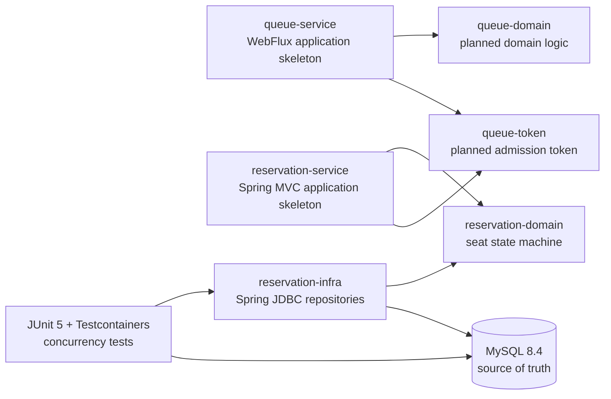

# RailGate

[](https://github.com/whdkfhr/rail-gate/actions/workflows/gradle-check.yml)

명절 기차표 예매처럼 짧은 시간에 요청이 집중되는 환경에서 **공정한 입장**과
**좌석 정합성**을 어떻게 보장할지 구현하고 검증하는 학습 프로젝트입니다.

실제 예매 시스템을 우회하거나 자동화하는 도구가 아닙니다. 기능 수를 빠르게 늘리기보다,
동시성 문제를 재현하고 불변식과 테스트로 설계의 근거를 남기는 데 초점을 둡니다.

> 현재 상태: 좌석 선점, 결제 전이, 만료, 해제의 동시성 코어를 구현했습니다.
> REST API와 애플리케이션 배선, 대기열, PG 연동은 아직 개발 중입니다.

## Why RailGate?

명절 예매 시스템에는 서로 다른 성격의 문제가 동시에 존재합니다.

- 순간적으로 몰리는 사용자를 순서대로 입장시켜야 합니다.
- 한 좌석은 아무리 많은 요청이 경쟁해도 한 예약에만 귀속되어야 합니다.
- 여러 좌석은 일부만 잡히지 않고 전부 성공하거나 전부 실패해야 합니다.
- 타임아웃, 재시도, 만료 처리가 발생해도 돈과 좌석 상태가 어긋나면 안 됩니다.

RailGate는 이 문제를 단순 CRUD가 아닌 **불변식 중심 설계**, **DB 동시성 제어**,
**결정적 경합 테스트**로 풀어보며 트레이드오프를 학습하기 위해 시작했습니다.

## Current Scope

| 영역 | 상태 | 현재 구현 |
|---|---|---|
| 좌석 도메인 | 완료 | 순수 Java 상태 머신, 값 객체, 복원 시 불변식 검증 |
| 단일 좌석 선점·확정 | 완료 | 조건부 `UPDATE`와 `affected_rows` 기반 성공 판정 |
| 다좌석 선점 | 완료 | 단일 벌크 `UPDATE`, 전부 성공 또는 전부 롤백 |
| 만료·자발적 해제 | 완료 | stale 후보 격리, 상태와 `hold_id`를 함께 검증하는 CAS |
| 트랜잭션 경계 | 완료 | 외부 트랜잭션 참여, NESTED savepoint로 저장소 로컬 원자성 보장 |
| 사용자별 선점 상한 | 실험 중 | 카운터 행 방식 검증 완료, 잠금 순서와 운영 연동은 후속 작업 |
| 애플리케이션 API | 예정 | 유스케이스, 포트, REST API, 멱등키 저장소 배선 |
| 대기열·결제·운영 | 예정 | Redis 대기열, 입장 토큰, Mock PG, 관측성, 부하 테스트 |

구현 여부와 목표 설계를 혼동하지 않도록, 아직 코드에 없는 기술과 기능은 로드맵으로
분리합니다. 상세 요구사항과 불변식의 현재 정의는 [`docs`](docs)에서 확인할 수 있습니다.

## Architecture

현재 저장소는 실행 애플리케이션과 재사용 가능한 도메인·인프라 모듈을 분리한
Gradle 멀티 모듈 구조입니다.



의존 방향은 `apps -> modules`, `infra -> domain`으로 제한합니다. 도메인 모듈에는
Spring, JPA, JDBC 의존성을 두지 않으며 이 규칙은 Gradle 검증 태스크에서도 검사합니다.

## Key Decisions

### 1. MySQL을 좌석 정합성의 최종 방어선으로 사용

좌석 상태를 먼저 조회한 뒤 갱신하는 check-then-act 방식은 요청 사이에 다른 트랜잭션이
끼어들 수 있습니다. RailGate는 상태와 소유권을 `WHERE` 절에서 함께 검사하는 조건부
`UPDATE`를 사용하고, `affected_rows`만을 성공 여부의 기준으로 삼습니다.

```sql
UPDATE seat_inventory
   SET status = 'HELD', hold_id = :holdId, held_by = :userId
 WHERE id = :seatId
   AND status = 'AVAILABLE';
```

Redis 분산 락이나 애플리케이션 객체의 락에 좌석 정합성을 맡기지 않습니다. MySQL만
살아 있어도 한 좌석이 두 번 확정되지 않는 구조를 목표로 합니다.

### 2. 다좌석 요청은 단일 벌크 갱신으로 처리

좌석별 반복 갱신은 중간 실패 시 부분 선점을 남길 수 있습니다. 요청 좌석 ID를 정렬한 뒤
한 번의 벌크 `UPDATE`로 변경하고, 변경된 행 수가 요청 수와 다르면 savepoint까지
롤백합니다. 이 방식은 원자성과 일관된 잠금 순서를 함께 확보합니다.

### 3. 동시성 경로에는 Spring JDBC를 선택

좌석 전이의 핵심은 어떤 SQL이 실행되고 몇 행이 바뀌었는지 명확히 통제하는 것입니다.
따라서 dirty checking으로 SQL과 갱신 시점이 간접화되는 JPA 대신 Spring JDBC를
사용했습니다. 이는 JPA 자체를 배제하기 위한 결정이 아니라, 정합성 핵심 경로의 의도를
코드와 SQL에 그대로 드러내기 위한 선택입니다.

### 4. 실제 MySQL에서 경합을 검증

인메모리 DB는 InnoDB의 행 잠금과 격리 동작을 대신 증명할 수 없습니다. 통합 테스트는
Testcontainers로 MySQL 8.4를 실행하며, `CountDownLatch`와 `CyclicBarrier`로 경쟁
시점을 통제합니다. 시간에 기대는 `Thread.sleep()` 대신 재현 가능한 인터리빙을 만듭니다.

## Tech Stack

| 기술 | 사용 이유 |
|---|---|
| Java 21 | 최신 LTS 기반의 명확한 타입 모델과 안정적인 동시성 도구 사용 |
| Spring Boot 4.1 | 실행 애플리케이션 구성과 테스트·관측 생태계 활용 |
| Gradle 9.6.1, Kotlin DSL | 멀티 모듈 경계와 의존성 규칙을 빌드에서 관리 |
| Spring JDBC | 조건부 SQL과 `affected_rows`, 트랜잭션 경계를 직접 제어 |
| MySQL 8.4, InnoDB | 행 잠금과 조건부 갱신을 이용한 좌석 정합성 보장 |
| Flyway | 스키마와 인덱스 변경 이력을 코드와 함께 버전 관리 |
| JUnit 5, AssertJ | 도메인 규칙과 실패 결과를 읽기 쉬운 테스트로 표현 |
| Testcontainers | 운영 DB와 같은 엔진에서 동시성·트랜잭션 동작 검증 |
| GitHub Actions | 모든 PR과 `main` 푸시에서 `./gradlew check` 자동 실행 |

Redis, Kafka, Prometheus, Grafana, k6는 목표 아키텍처에 포함되어 있지만 아직 구현하지
않았습니다. 필요한 단계에서 실험과 측정 근거를 만든 뒤 도입할 예정입니다.

## Verification Strategy

RailGate는 “부하 테스트에서 우연히 오류가 없었다”를 정합성의 증명으로 보지 않습니다.
각 핵심 불변식은 다음 세 층으로 확인합니다.

1. **구조적 논증**: InnoDB 행 잠금과 조건부 `UPDATE`가 왜 중복 전이를 막는지 설명합니다.
2. **결정적 검증**: barrier와 latch로 충돌 순서를 만들어 반복 테스트합니다.
3. **통계적 검증**: 이후 부하 테스트와 사후 정합성 쿼리로 위반 여부를 관찰합니다.

각 작업의 가설, 실패 재현, 선택한 해결책과 남은 위험은
[`docs/experiments`](docs/experiments)에 기록합니다.

## Project Structure

```text
rail-gate/
├── apps/
│   ├── queue-service/          # 대기열 애플리케이션 골격
│   └── reservation-service/    # 예매 애플리케이션 골격
├── modules/
│   ├── common/                 # 최소 공용 타입
│   ├── queue-domain/           # 대기열 도메인 예정
│   ├── queue-token/            # 입장 토큰 예정
│   ├── reservation-domain/     # 좌석 상태 머신과 값 객체
│   └── reservation-infra/      # JDBC 저장소, Flyway, MySQL 통합 테스트
└── docs/
    ├── REQUIREMENTS.md         # 기능·비기능 요구사항
    ├── INVARIANTS.md           # 시스템 불변식과 검증 방법
    ├── ARCHITECTURE.md         # 목표 아키텍처와 의존 규칙
    ├── DEVELOPMENT_GUIDE.md    # 개발·테스트 규칙
    └── experiments/            # 작업별 가설과 실험 결과
```

## Run Tests

### Prerequisites

- Docker가 실행 중인 환경
- Java 21 또는 Gradle toolchain을 내려받을 수 있는 환경

```bash
./gradlew check
```

이 명령은 단위·통합 테스트와 모듈 의존 방향, 도메인 순수성 규칙을 함께 검증합니다.
Testcontainers 통합 테스트 때문에 Docker가 필요합니다. 아직 서비스 간 유스케이스 배선과
외부 API가 완성되지 않아, 현재는 전체 애플리케이션 실행보다 테스트가 주된 실행 진입점입니다.

## Roadmap

1. 사용자별 선점 상한의 잠금 순서와 세 이탈 경로(확정·만료·해제) 연동
2. 애플리케이션 서비스와 포트, REST API, 멱등키 저장소 구성
3. Redis Lua 기반 대기열과 서명된 입장 토큰, SSE 구현
4. Mock PG의 authorize/capture 흐름과 실패 복구 구현
5. Prometheus·Grafana 관측성, k6 부하 테스트, 정합성 검증 자동화
6. 측정 결과에 따라 Kafka Outbox/Inbox와 확장 전략 검토

## Documents

- [요구사항](docs/REQUIREMENTS.md)
- [시스템 불변식](docs/INVARIANTS.md)
- [아키텍처](docs/ARCHITECTURE.md)
- [개발 가이드](docs/DEVELOPMENT_GUIDE.md)
- [동시성 실험 기록](docs/experiments)
