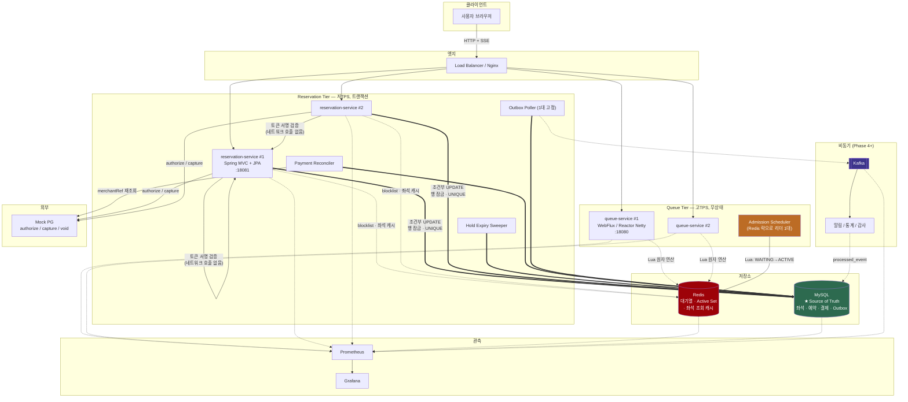
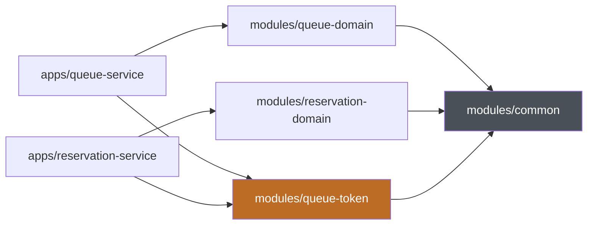

# RailGate — 아키텍처

> 상태: 초안 v0.1 (2026-07-28)
> 관련 문서: [REQUIREMENTS.md](REQUIREMENTS.md), [INVARIANTS.md](INVARIANTS.md)

---

## 1. 설계 원칙

1. **MySQL 이 유일한 진실의 원천이다.** Redis 와 Kafka 는 정합성 경로에 없다.
2. **Redis 는 트래픽 게이트, MySQL 은 정합성 방어선.** 역할을 섞지 않는다.
3. **서비스 간 동기 HTTP 호출은 0회.** 결합도가 곧 장애 전파 경로다.
4. **측정 없이 최적화하지 않는다.** 샤딩·캐시는 병목이 실측된 뒤에만.
5. **모든 설계 결정은 어떤 불변식을 지키기 위한 것인지로 설명된다.**

---

## 2. 논리 아키텍처



---

## 3. 모듈 구성

### 현재 (Phase 0)

```
rail-gate/
├── settings.gradle.kts          # 모듈 등록 · 저장소 선언
├── build.gradle.kts             # 공통 규약 (Java 21 toolchain, BOM, 테스트)
├── gradle/libs.versions.toml    # 버전 단일 출처
├── CLAUDE.md
├── docs/
│   ├── REQUIREMENTS.md
│   ├── INVARIANTS.md
│   └── ARCHITECTURE.md
├── apps/
│   ├── queue-service/           # WebFlux  :18080
│   └── reservation-service/     # MVC      :18081
└── modules/
    ├── common/                  # 에러 · 식별자 · Clock 추상화
    ├── queue-domain/            # 순수 Java. 순번 계산 · 상태 전이
    ├── queue-token/             # ★ 두 앱의 유일한 접점
    └── reservation-domain/      # 순수 Java. 좌석 · 예약 · 결제 상태 머신
```

### 계획된 추가 모듈

| 모듈 | 추가 시점 | 이유 |
|---|---|---|
| `modules/reservation-infra` | Phase 1 | JPA · 멱등성 · PG 클라이언트. 지금 만들면 빈 껍데기 |
| `modules/queue-redis` | Phase 2 | Lua 스크립트 · 키 전략 · Reactive Redis |
| `modules/kafka-support` | Phase 4 | Outbox · Inbox · Retry/DLT |
| `apps/mock-pg` | Phase 1 | 독립 PG 시뮬레이터 컨테이너 |

> 모듈은 **필요해질 때** 만든다. 미리 만든 빈 모듈은 경계를 강제하지 않고 노이즈만 만든다.

### 의존 규칙



| 규칙 | 내용 |
|---|---|
| 방향 | 항상 `apps → modules`. 역방향 금지 |
| 도메인 순수성 | `*-domain` 의 **main 소스에 Spring / JPA / Redis 금지** |
| 서비스 격리 | `queue-*` 와 `reservation-*` 는 서로를 참조하지 않는다 |
| 공통 접점 | `queue-token` 하나뿐 |

`queue-domain` 을 `queue-redis` 에서 분리하는 이유는 두 가지다.
Redis 없이 순번 로직을 단위 테스트할 수 있어야 하고,
Phase 6 에서 대기열을 샤딩할 때 도메인을 건드리지 않고 인프라만 교체하기 위해서다.

---

## 4. 저장소별 책임 경계

| | Redis | MySQL | Kafka |
|---|---|---|---|
| **역할** | 트래픽 게이트 · 캐시 | **유일한 진실의 원천** | 사후 이벤트 전파 |
| **담당** | 대기 순번, Active Set, 토큰 blocklist, 좌석 조회 캐시, rate limit | 좌석 재고, 선점, 예약, 결제, 멱등키, Outbox | 알림, 통계, 감사 로그 |
| **절대 담당 안 함** | 좌석 재고의 진실, 결제 상태 | 대기 순번 (성능상 불가) | 좌석 선점 판정, 예약 확정 |
| **소실 시 영향** | 대기열 붕괴. **예매는 계속 동작** | **전면 중단** | 부가 기능만 지연 |
| **일관성 모델** | 최선 노력 | 강한 일관성 (ACID) | 최종 일관성 |

---

## 5. 기술 선택 근거

### 5.1 왜 멀티모듈 모놀리스 + 2개 앱인가

| 대안 | 평가 |
|---|---|
| 단일 앱 | WebFlux 와 MVC+JPA 를 한 앱에 섞으면 스레드 모델이 충돌한다(블로킹 JDBC 가 이벤트 루프 점유). 두 서비스의 스케일 특성이 100배 차이나는데 함께 스케일해야 한다. **부적합** |
| 완전 분리 MSA | 스키마 공유, 버전 정합, 로컬 개발 환경, CI 가 전부 2배. 이 규모에서는 **과도** |
| **멀티모듈 + 2앱 (채택)** | 도메인 경계는 모듈로 강제, 배포·스케일은 독립. 단일 저장소로 리팩터링 비용 최소. 나중에 모듈 단위로 잘라내면 저장소 분리 가능 |

### 5.2 왜 서비스 간 동기 호출을 하지 않는가

`reservation-service` 가 `queue-service` 에 "이 사용자 입장했나요?" 를 물으면:

- 좌석 API 전체가 대기열 서비스의 가용성에 종속된다
- 20,000 TPS 서비스의 지연을 300 TPS 서비스가 흡수하게 된다

대신 **입장 토큰(JWT, HMAC 서명)** 을 쓴다. 서명 검증은 CPU 연산이므로 네트워크 호출이 0회다.
취소·강제 만료가 필요할 때만 공유 Redis 의 blocklist 를 조회하며, 이는 로컬 캐시(1초)로 완충한다.

### 5.3 왜 Queue 는 WebFlux, Reservation 은 MVC 인가

| | queue-service | reservation-service |
|---|---|---|
| 부하 특성 | 20,000 TPS, **20만 동시 커넥션** | 300 TPS, 짧은 요청 |
| 작업 성격 | Redis I/O 1회, CPU 거의 없음 | 트랜잭션, 여러 쿼리, 복잡한 도메인 로직 |
| 블로킹 요소 | 없음 (Lettuce 논블로킹) | **JDBC 는 근본적으로 블로킹** |
| 채택 | **WebFlux** (Netty) | **MVC** (Tomcat) |

**WebFlux 의 진짜 근거는 SSE 다.** 20만 개의 장시간 커넥션은 플랫폼 스레드로 불가능하다
(스레드당 ~1MB 스택 × 20만). 순번 조회가 **폴링만** 이라면 WebFlux 의 이점은 미미하다.

**단, Java 21 의 Virtual Thread 가 이 구도를 흔든다.** MVC + 가상 스레드는 커넥션당 힙 수백 바이트로
수십만 커넥션을 처리하면서 명령형 코드의 단순함을 유지한다.

> **따라서 결론은 "WebFlux 를 쓴다" 가 아니라
> "WebFlux 를 쓰되 Phase 6 에서 가상 스레드 버전과 동일 부하로 비교 측정하고 결과를 공개한다" 이다.**
> 측정 결과가 가상 스레드 승리로 나와도 그대로 게시한다. 그것도 유효한 결과다.

### 5.4 왜 대기열에 Redis 인가 (Kafka 가 아니라)

| 요구사항 | Redis | Kafka |
|---|---|---|
| "내 순번이 몇 번인가" 랜덤 조회 | O(1) 카운터 | **불가능.** 오프셋은 컨슈머 그룹 진행도이지 개별 사용자 위치가 아님 |
| 동일 사용자 중복 등록 방지 | ZSET member 유일성 + Lua | **불가능.** 중복 발행분이 그대로 쌓임 |
| 대기 취소 (중간 항목 제거) | `ZREM` | **불가능.** 로그는 불변 |
| 엔트리 TTL 자동 만료 | 네이티브 TTL | 없음 (retention 은 전체 단위) |
| 전역 FIFO | 자연스러움 | **파티션 N개면 FIFO 도 N개로 쪼개짐** |

Kafka 로 엄격한 선착순을 구현하려면 파티션이 1개여야 하고, 그러면 처리량 이점이 사라진다.

단, **입장 이력을 `queue.admitted` 이벤트로 발행해 공정성 감사에 쓰는 것**은 Kafka 에 적합하다.
이는 "대기열을 Kafka 로 구현" 하는 것과 전혀 다르다.

### 5.5 왜 좌석 선점을 Kafka 로 비동기 처리하지 않는가

1. **UX 악화** — 사용자는 선점 성공/실패를 즉시 알아야 한다. "요청 접수됨" 은 "이 좌석 나갔습니다" 보다 나쁘다
2. **결국 폴링이 필요** — 결과 수신 채널의 부하가 원래 부하보다 클 수 있다
3. **Consumer lag 이 사용자 지연** — Kafka 의 강점(버퍼링)이 여기선 약점
4. **DB 경합은 사라지지 않음** — 컨슈머가 결국 같은 DB 에 쓴다. 병목이 이동할 뿐
5. **오히려 느려짐** — 파티션 키를 `seatId` 로 하면 동시성이 파티션 수로 제한된다. 조건부 UPDATE 는 서로 다른 좌석을 완전 병렬 처리한다
6. **at-least-once 가 중복 선점 위험** — 결국 멱등성 처리가 필요한데 동기 방식도 이미 한다. 순증 복잡도
7. **보상 트랜잭션 필요** — 동기는 `ROLLBACK` 한 줄. 비동기는 I-9(전부-또는-전무)를 지키기가 훨씬 어렵다

**유일한 이득(좌석별 직렬화)은 조건부 UPDATE + 행 잠금이 이미, 그리고 더 세밀한 단위로 제공한다.**

### 5.6 왜 조건부 UPDATE 인가 (잠금 전략 비교)

| 전략 | 장점 | 단점 | 채택 |
|---|---|---|---|
| **조건부 UPDATE (CAS)** | 왕복 1회, 짧은 잠금, 경합 시 fail-fast | 실패 이유를 별도 조회 | ✅ **주 전략** |
| 비관적 잠금 (`FOR UPDATE`) | 복잡한 판정 가능 | 왕복 2회, 잠금 보유 시간 증가 | 필요 시 제한적 |
| 낙관적 잠금 (`@Version`) | JPA 자연 통합 | 고경합에서 재시도 폭풍 (1,000 경합 = 999 재시도) | ❌ |
| Redis 분산 락 | DB 부하 감소 | **정확성 보장 불가** (GC pause, 클럭 드리프트, 락 만료 후 실행 계속) | ❌ 최종 보장으로는 금지 |
| UNIQUE 제약 | 최후 방어선 | 예외 처리 필요 | ✅ 안전망으로 병행 |

> Redis 분산 락은 **성능 최적화이지 정확성 보장이 아니다.**
> Phase 6 실험 C 에서 "Redis 락만 사용" 버전으로 **초과 예매를 실제로 발생시켜** 이를 실증한다.

---

## 6. 단일 장애 지점 · 병목 예상 지점

| 지점 | 위험 | 완화 |
|---|---|---|
| **Redis 단일 노드** | SPOF. 대기열 전면 정지 | Sentinel/Cluster. **fail-closed** 정책. AOF everysec |
| **`queue:{eventId}` 단일 키** | hash tag 로 단일 슬롯 집중. Lua 포함 시 노드당 2~4만 TPS 추정 `가정` | Phase 3 실측 → 한계 도달 시 Phase 6 샤딩 |
| **Admission Scheduler** | 다중 실행 시 중복 승격 | Redis 락(최적화) + **Lua 원자 승격(정확성)**. 정확성은 락이 아니라 Lua 가 보장 |
| **인기 좌석 단일 행** | 1,000 동시 요청의 잠금 대기 | 짧은 트랜잭션 + `innodb_lock_wait_timeout=3` (기본 50초는 커넥션 풀을 고갈시킨다) |
| **MySQL 커넥션 풀** | 좌석 선점 폭주 시 고갈 | **트랜잭션 안에서 외부 I/O 금지** (1번 원인). Bulkhead 로 조회/선점 풀 분리 |
| **Mock PG 지연** | 스레드 점유 | 타임아웃 3초, 별도 스레드 풀, `UNKNOWN` + 재조회 |
| **Outbox Poller** | 다중화 시 **순서 역전** | **1대 고정.** `SKIP LOCKED` 는 순서를 보장하지 않는다 |

---

## 7. 확장 전략

| 단계 | 내용 |
|---|---|
| Phase 1~3 | 단일 Redis, 단일 MySQL, 앱 각 1대. **병목 실측이 목적** |
| Phase 3 이후 | 앱 수평 확장, MySQL read replica 로 좌석 조회 분리 |
| Phase 6 | Redis 대기열 샤딩, WebFlux vs Virtual Thread 비교 |
| Phase 7 | 클라우드 배포. **절대 TPS 를 주장할 수 있는 유일한 단계** |

### 대기열 샤딩의 대가 (Phase 6)

```
rg:{evt:E1:s0}:waiting ... rg:{evt:E1:s15}:waiting   (16 샤드)
사용자 → hash(userId) % 16 으로 고정 배정
순번   → 샤드별 INCR (전역 카운터가 새 병목이 되므로)
승격   → 16개 샤드에서 라운드로빈으로 N/16씩
```

**전역 엄격 FIFO 가 깨지고 샤드 내 FIFO + 샤드 간 근사 공정성이 된다.**
무손실 확장은 없다. 어떤 공정성을 얼마나 포기했는지 **역전율로 정량 측정**하는 것이
이 프로젝트의 핵심 산출물 중 하나다.

---

## 8. 개발 로드맵

| Phase | 내용 | 완료 조건 |
|---|---|---|
| **0** | 멀티모듈 골격, Docker Compose, CI | `docker compose up` → health 200 |
| **1** ★ | 좌석 정합성 코어 (대기열 없이) | T-2/3/4/5 통과, V-1~V-6 전부 0행, 데드락 0건 |
| **2** | Redis 대기열 (Lua, 스케줄러, JWT, SSE) | T-1/T-7 통과, 30분 구동 후 유령 엔트리 0 |
| **3** ★ | 축소 모델 확정 → k6 → 병목 개선 Before/After | k6 CPU < 90% 인 유효 측정 + 비율 지표 개선 수치 |
| **4** | Kafka + Outbox/Inbox (토픽 2개로 축소) | T-6 통과, Kafka 중단 중 예매 성공률 무변화 |
| **5** | 장애 주입 + 취소/재판매 | 8종 장애 전부 검증, 각각 초과 예매 0 |
| **6** | 확장성 실험 A~D | 4개 벤치마크 보고서 |
| **7** | 클라우드 배포 (선택) | 공개 URL 에서 부하 테스트 재현 |

---

## 9. ADR 목록 (작성 예정)

| ID | 제목 |
|---|---|
| ADR-001 | 좌석 동시성 제어에 조건부 UPDATE 를 선택한 이유 |
| ADR-002 | 대기열 저장소로 Redis 를 선택한 이유 |
| ADR-003 | 순번 조회를 ZRANK 가 아닌 카운터 기반으로 구현한 이유 |
| ADR-004 | 멀티모듈 모놀리스 + 2앱 구성을 선택한 이유 |
| ADR-005 | Queue Service 에 WebFlux 를 선택한 이유와 Virtual Thread 재검토 계획 |
| ADR-006 | 서비스 간 통신을 토큰 서명 검증으로 대체한 이유 |
| ADR-007 | 좌석 선점을 동기로 유지하는 이유 |
| ADR-008 | Transactional Outbox 를 채택한 이유 |
| ADR-009 | 멱등성 키 설계 (리스 방식, 3단 트랜잭션 경계) |
| ADR-010 | 결제를 authorize/capture 2단계로 나눈 이유 |
| ADR-011 | Redis 장애 시 fail-closed 정책 |
| ADR-012 | Kafka 토픽을 생애주기 단위로 통합한 이유 |
| ADR-013 | 부하 테스트 도구로 k6 를 선택한 이유 |
| ADR-014 | 대기열 샤딩 전략과 공정성 트레이드오프 |
