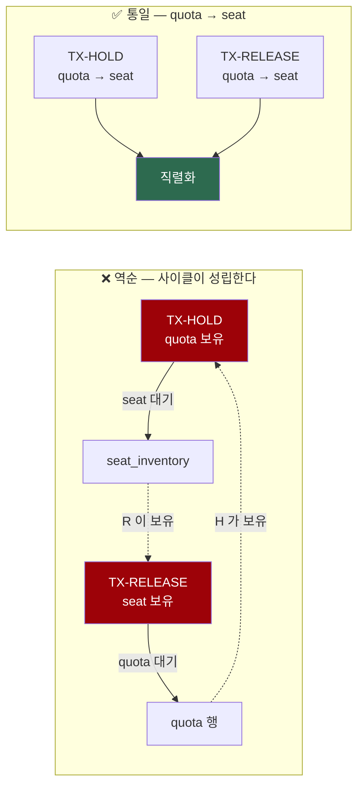

# 실험 — quota ↔ seat 잠금 순서와 데드락 (Task 2G-B)

> TASK-002G-B · 2026-08-25
> 관련: [INVARIANTS.md](../INVARIANTS.md) I-9·I-12, [CLAUDE.md](../../CLAUDE.md) 규칙 1·2·3·8·9·10·11·21·26·30
> 선행: [2G-A](TASK-002G-user-hold-quota-race.md) · [2F](TASK-002F-transaction-boundary.md) · [2E](TASK-002E-seat-hold-release.md) · [2D](TASK-002D-seat-expiry-sweeper.md)

## 1. 목적과 범위

Task 2G-A 는 잠금 순서 충돌을 **"구조적으로 가능해 보인다"** 고만 기록하고 재현하지 않았다.
이번 Task 는 그 가설을 **실제 MySQL 로 결정적으로 재현**하고, 통일안이 문제를 없애는지 검증한다.

**이번 단계에서 만들지 않은 것:** 운영 마이그레이션, 운영 quota 저장소, 애플리케이션 서비스,
REST API, 운영 예외. **운영 좌석 저장소도 한 줄도 바꾸지 않았다.**
통일 순서는 테스트가 **애플리케이션 서비스 역할을 흉내낸 후보 흐름**이다.

범위 키(`event_id` vs `schedule_id`)는 여전히 **미결정**이며 이번에도 확정하지 않았다 (2G-A §9).
만료 스위퍼의 사용자별 집계는 **Task 2G-C** 로 남긴다 (§10).

---

## 2. 현재 잠금 순서

| 경로 | 1순위 | 2순위 | 근거 |
|---|---|---|---|
| quota 증가 + 다좌석 선점 | **quota 행** (`tryAcquire` 조건부 UPDATE) | `seat_inventory` id 오름차순 | `JdbcMultiSeatHoldRepository` — `requireEnlistedTransaction` → `lockOrder` → NESTED savepoint 안 벌크 UPDATE |
| 자발적 해제 + quota 감소 | `seat_inventory` id 오름차순 | **quota 행** | `JdbcSeatReleaseRepository.releaseAll` — 후보 SELECT(비잠금) → 정렬 → `FORCE INDEX (PRIMARY)` UPDATE |
| `PAYING → SOLD` + quota 감소 | `seat_inventory` 단일 행 | **quota 행** | `JdbcSeatPaymentRepository.confirm(seatId, …)` |
| 만료 회수 + quota 감소 | `seat_inventory` id 오름차순 | **quota 행 N개** | 2G-C 로 유보 |



---

## 3. ★ 역순 잠금 데드락의 결정적 재현

### 재현 절차

같은 사용자·같은 quota 범위·**같은 좌석**을 두고 두 트랜잭션을 경합시킨다.
순서는 `CountDownLatch` 가 고정한다. `Thread.sleep` 은 쓰지 않는다.

```
TX-RELEASE                              TX-HOLD
──────────────────────────────────────  ──────────────────────────────────────
(1) releaseAll(...)  → seat 잠금 보유
    seatLocked.countDown() ─────────▶   (1) await(seatLocked)
                                        (2) tryAcquire(...) → quota 잠금 보유
                        ◀─────────────      quotaLocked.countDown()
(2) await(quotaLocked)                  (3) holdAll(같은 좌석) → seat 대기 ⛔
(3) quota.release(...) → quota 대기 ⛔
```

**latch 는 잠금을 얻은 직후에만 신호한다.** 잠금을 쥔 채 서로를 기다리는 위치에 두면
테스트 자체가 멈추므로, 실제 대기는 DB 잠금에만 맡겼다. 모든 `await` 에 timeout 을 걸었고
클래스에 `@Timeout(180)` 을 뒀다.

### 실제 관측 결과

```
[Task 2G-B] 역순 잠금 관측 결과:
  [TX-HOLD: TransactionSystemException (SQLState=40001, vendorCode=1213)]
```

| 항목 | 값 |
|---|---|
| MySQL vendor code | **1213** (Deadlock found when trying to get lock) |
| SQLState | **40001** |
| 데드락이 난 문장 | `holdAll` 의 `UPDATE seat_inventory FORCE INDEX (PRIMARY) … WHERE id IN (?,?) AND status='AVAILABLE'` |
| 밖으로 나온 Spring 예외 | `TransactionSystemException` |

**잠금 대기 초과(1205)가 아니라 데드락(1213)이다.** 테스트가 두 코드를 구분해 단언한다 —
1205 가 관측되면 사이클 재현이 아니라 단순 대기이므로 실패로 처리한다.
세션에는 `innodb_lock_wait_timeout = 3` 이 설정되어 있어(규칙 9) 대기였다면 3초 후 1205 가 났을 것이다.

### ⚠ NESTED savepoint 가 데드락 예외를 덮는다 — 이번에 새로 관측한 사실

처음 작성한 분류기는 **원인 사슬만** 훑었고, 그 결과 다음을 관측했다.

```
[TX-HOLD: TransactionSystemException (SQLState=42000, vendorCode=1305)]
```

**1305 는 `SAVEPOINT ... does not exist` 다.** 이유는 이렇다.

1. `holdAll` 은 NESTED savepoint 안에서 실행된다 (Task 2F).
2. 그 안에서 데드락이 나면 InnoDB 가 **트랜잭션 전체를 롤백**한다 → savepoint 가 사라진다.
3. Spring 이 savepoint 로 롤백하려다 실패하고, 원래 예외를 덮어쓴다
   (로그: `Application exception overridden by rollback exception`).
4. 밖에서 보이는 원인 사슬에는 **1305 만 남고 1213 은 없다.**

실제 데드락은 `TransactionSystemException.getApplicationException()` 쪽에 있었다
(그 안의 로그: `CannotAcquireLockException: … Deadlock found when trying to get lock`).
분류기를 **원인 사슬 + applicationException 두 갈래**를 훑도록 고친 뒤에야 1213/40001 이 드러났다.

> **이것은 Task 2F 설계에 대한 새 위험이다.** 앱 계층이 같은 방식으로 풀어보지 않으면
> **데드락을 다른 기술 오류로 오분류**하게 된다. §11 의 남은 위험에 기록했다.

### 희생자는 계약이 아니다

어느 트랜잭션이 롤백되는지는 **MySQL 이 정한다.** 이 실행에서는 TX-HOLD 가 희생됐지만
그것을 계약으로 고정하지 않았다. 테스트는 "둘 중 하나에서 데드락이 관측된다" 만 단언한다.

### 데드락 후 최종 정합성

| 확인 | 결과 |
|---|---|
| `held_seats` == 실제 `HELD`/`PAYING` 좌석 수 | **일치** |
| `held_seats` 범위 | 0 이상 4 이하 |
| 활성 좌석 | 0석 또는 2석 (**부분 선점 없음**) |
| 기술적 데드락을 좌석 경합으로 오분류 | 없음 — `SeatUnavailableException` 과 구분 |

**트랜잭션 롤백이 정합성을 지켜준다.** 데드락은 가용성 문제이지 정합성 문제가 아니다.

---

## 4. quota → seat 통일 후보 흐름

운영 저장소를 바꾸지 않고 **호출 순서만** 바꿨다.

### 해제 후보 흐름

```java
tx { // 최상위 트랜잭션은 호출자(향후 앱 서비스)가 소유
    quota.lockQuotaRow(userId, scopeId);              // (1) quota 먼저 — SELECT ... FOR UPDATE
    int released = releaseRepository.releaseAll(...); // (2) seat
    if (released > 0) {                               // 0 이면 감소 SQL 자체를 실행하지 않는다
        boolean ok = quota.release(userId, scopeId, released);  // 실제 affected_rows 기준
        if (!ok) throw ...;                           // 실패하면 좌석 해제까지 롤백
    }
}
```

`lockQuotaRow` 의 목적은 **값 판단이 아니라 순서 통일**이다. 그 값으로 상한을 판단하면
규칙 8 이 금지한 집계-후-판단으로 되돌아간다. 상한 검사는 여전히 `tryAcquire` 의 조건부 UPDATE 다.

감소 경로가 잠금만 먼저 잡는 이유는 **감소량을 좌석 UPDATE 후에야 알 수 있기** 때문이다.

### 선점 후보 흐름

```java
tx {
    if (!quota.tryAcquire(userId, scopeId, n)) throw QuotaRejected;  // (1) quota
    holdRepository.holdAll(plan, holdId, userId);                    // (2) seat
}                                                                    // 예외는 경계 밖으로 전파
```

선점은 원래부터 `quota → seat` 였다. 바뀐 것은 해제 쪽이다.

---

## 5. 통일 순서 검증 결과

역순 실험과 **같은 사용자·같은 좌석**으로 경합시켰다.

### 허용되는 스케줄링 결과는 두 가지다

두 흐름은 quota 행에서만 직렬화되므로 **어느 쪽이 quota 를 먼저 잡느냐**에 따라 결과가 갈린다.
둘 다 정상이며, 어느 하나를 계약으로 고정하지 않는다.

| | 결과 A | 결과 B |
|---|---|---|
| quota 를 먼저 잡은 쪽 | **해제** | **선점** |
| 진행 | 기존 좌석 해제 + quota 감소 → 그 뒤 선점 진행 | 아직 `HELD` 인 좌석을 다시 잡으려다 실패 → quota 증가도 최상위 트랜잭션과 함께 롤백 → 그 뒤 해제 진행 |
| 두 트랜잭션 | 둘 다 성공 | 선점만 실패 |
| `failures` | `[]` | `[SeatUnavailableException]` |

**두 결과 모두 실제로 관측했다.** 같은 테스트를 3회 반복 실행한 결과:

```
실행 1: [Task 2G-B] 통일 순서 관측 결과: [TX-HOLD: SeatUnavailableException (SQLState=null, vendorCode=0)]
실행 2: [Task 2G-B] 통일 순서 관측 결과: []
실행 3: [Task 2G-B] 통일 순서 관측 결과: []
```

> **"통일 순서에서는 아무 실패도 없다" 고 쓰지 않는다.** 좌석이 겹치는 경합에서
> `SeatUnavailableException` 은 **예상 가능한 정상 실패**이며(규칙 21) 데드락과 성격이 다르다.
> 두 결과의 공통 조건은 **데드락·1205 가 없고 최종 quota 와 활성 좌석 수가 일치한다**는 것이다.

### 테스트 oracle — 허용 목록 방식

`runBoth` 는 작업 스레드의 **모든 `Throwable`** 을 `Failure` 로 바꾼다. "데드락만 없으면 통과" 로
검증하면 다른 SQL 오류·`NullPointerException`·배선 실수·스레드 안의 `AssertionError` 까지
조용히 통과한다 — false positive 다.

그래서 **허용 목록으로 뒤집었다.** `assertUnifiedContentionFailuresAreExpected(...)` 가
한곳에서 검증한다.

- 데드락(1213/40001) 없음
- 잠금 대기 초과(1205) 없음
- **모든 실패가 `SeatUnavailableException`** (SQL 오류가 아니므로 벤더 코드가 없다)
- 크기 **0 또는 1** — 두 흐름은 quota 행에서 직렬화되므로 동시에 둘 다 실패할 수 없다

`통일_순서로_경합시킨다(...)` 를 호출하는 모든 테스트가 **반환값을 검증**한다.
최종 상태만 보고 통과하는 테스트는 없다.

### 검증 결과

| 검증 | 결과 |
|---|---|
| 데드락(1213/40001) | **없음** |
| 잠금 대기 초과(1205) | **없음** |
| 알 수 없는 실패 | **없음** (허용 목록 검증) |
| 관측된 실패 | `[]` 또는 `SeatUnavailableException` 하나 — 둘 다 정상 |
| `held_seats` == 활성 좌석 수 | 일치 |
| `held_seats` 범위 | 0 이상 4 이하 |
| 부분 선점 | 없음 (I-9) |
| **겹치지 않는 좌석** 요청 | **반드시 2석 전부 선점** — 실패 0건, 부분 성공(1석)도 전체 실패(0석)도 허용하지 않는다 |
| 해제 0건일 때 quota 감소 SQL | **실행하지 않음** |
| quota 감소 거부 시 | 좌석 해제도 **롤백**, 드리프트 없음 |
| 외부 롤백 시 | quota·좌석 **함께 원복** |

**먼저 quota 행을 잡은 트랜잭션이 끝난 뒤 상대가 진행한다.** 두 경로가 같은 자원을
같은 순서로 요청하므로 순환 대기가 성립하지 않는다.

### 근거의 층위를 구분한다

| 층 | 내용 |
|---|---|
| **구조적 논증** | 두 경로가 `quota → seat` 로 같은 순서를 쓰면 순환 대기 그래프가 만들어지지 않는다. 이것이 핵심 근거다 |
| **결정적 재현** | §3 의 latch 기반 대기 그래프 고정. 실행할 때마다 같은 사이클이 만들어진다 |
| **반복 실행 결과** | 3회 반복에서 데드락이 관측되지 않았다는 것은 **보조 근거**다. 부재의 증명이 아니다 |

> **"한 번 데드락이 나지 않았다" 로 부재를 증명했다고 쓰지 않는다** (규칙 30).
> 통일 순서의 근거는 잠금 순서 논증이고, 실행 결과는 그것과 모순되지 않았다는 관측이다.

---

## 6. 감소 규칙 재확인

2G-A 가 정한 원칙이 통일 순서에서도 유지된다.

- 감소량은 **요청 좌석 수가 아니라 실제 `affected_rows`**
- 해제 결과가 0 이면 **감소 SQL 자체를 실행하지 않는다** (테스트가 호출 횟수로 확인)
- **감소의 반환값도 확인한다.** 거부되면 예외를 던져 좌석 해제까지 롤백한다 —
  그러지 않으면 2G-A §7 B 의 드리프트가 남는다

드리프트 상태(좌석 2석 / quota 1)를 만들어 감소가 거부되게 한 뒤,
좌석이 **2석 그대로 롤백**되고 quota 도 1 로 유지되는 것을 확인했다.

---

## 7. 검증된 사실과 아직 검증하지 않은 가정

### 검증된 것 (실제 MySQL 8.4 Testcontainers, 9 tests)

- 역순 잠금(`seat → quota` vs `quota → seat`)은 **실제 MySQL 데드락(1213/40001)을 만든다**
- 그 데드락은 잠금 대기 초과(1205)와 구분된다
- NESTED savepoint 안에서 데드락이 나면 **1305 로 덮여** 원인 사슬에 1213 이 남지 않는다
- 데드락 희생자와 무관하게 롤백이 정합성을 지킨다 (quota == 활성 좌석, 부분 선점 없음)
- 통일 순서에서는 같은 경합이 데드락·잠금 대기 초과 없이 끝난다
- 해제 0건이면 quota 감소 SQL 을 실행하지 않는다
- quota 감소가 거부되면 좌석 해제도 롤백된다
- 외부 롤백 시 quota·좌석이 함께 원복된다

### 아직 검증하지 않은 것

- **통일 순서의 처리량 영향** — quota 행 잠금 보유 구간이 좌석 UPDATE 시간만큼 길어진다. 같은 사용자의 동시 요청 처리량에 영향이 있을 텐데 **측정하지 않았다**
- **확정(`PAYING → SOLD`) 경로의 통일** — `confirm` 은 좌석 1건씩 처리한다. quota 를 먼저 잠그는 흐름을 실험하지 않았다
- **만료 스위퍼 경로** — 여러 사용자·여러 quota 행이 얽힌다. Task 2G-C
- **3자 이상 사이클** — 선점·해제·확정이 동시에 얽히는 경우
- **`lockQuotaRow` 가 행이 없을 때** — `null` 을 돌려주고 아무것도 잠그지 않는다. 첫 요청 경로와 결합했을 때의 동작은 실험하지 않았다
- **quota delta 의 0·음수 입력 계약** — 2G-A 부터 열려 있다

---

## 8. 운영 코드를 변경하지 않은 이유

1. **통일 순서를 강제할 주체가 아직 없다.** 순서는 저장소 하나가 아니라 **호출자(앱 서비스)** 가
   정한다. 그 계층이 없는 상태에서 저장소에 순서를 박으면 잘못된 위치에 책임을 두게 된다.
2. **범위 키가 미결정이다** (2G-A §9). quota 저장소의 시그니처가 그 키에 달려 있다.
3. **만료 경로의 계약이 미결정이다** (§10). 네 경로 중 하나가 열려 있으면 통일안을 확정할 수 없다.
4. 이 프로젝트는 마이그레이션을 "적용됨, 수정 금지" 로 다룬다. 되돌리기 어려운 결정이다.

---

## 9. 범위 키는 여전히 미결정이다

> *(→ [TASK-002G-D](TASK-002G-D-quota-scope-contract.md) 에서 **판매 이벤트(`sale_event_id`) 단위**로 결정됐다.
> 아래 내용은 당시의 미결정 상태를 기록한 역사적 설명이다.)*

2G-A §9 의 결론을 그대로 유지한다. `seat_inventory` 는 `schedule_id` 만 가지고 event 모델이 없다.
`schedule_id` 로 두면 편을 바꿔가며 잡을 수 있어 사재기 방지가 무력해진다.
**이번 Task 에서도 확정하지 않았고**, 실험은 중립적인 `quota_scope_id` 를 쓴다.

---

## 10. Task 2G-C 권장 범위 — 만료 사용자별 집계

> *(→ [TASK-002G-C](TASK-002G-C-expiry-quota-attribution.md) 에서 수행했다.
> 아래는 TASK-002G-B 시점의 계획이며 그대로 유지한다.)*

2G-A 가 남긴 문제를 그대로 이어받는다. **이번 Task 에서 임의로 해결하지 않았다** —
`ExpiryCandidate` 도 `JdbcSeatExpiryRepository` 도 바꾸지 않았다.

### 먼저 재현해야 할 시나리오

- 사용자 A 와 B 의 만료 후보가 **한 배치**에 포함된다
- 사용자별 후보 수가 **서로 다르다**
- 한 사용자 쪽에 **partial stale 후보**가 있다 (후보 SELECT 이후 확정·해제·연장)
- **`affected_rows` 총합만으로는 사용자별 실제 회수 수를 배분할 수 없음**을 보인다
- 후보에 `held_by` 가 있어도 충분하지 않음을 보인다

### 그 뒤 비교할 대안

1. 후보를 (scope, user) 로 그룹화해 **사용자별 조건부 UPDATE** → 그룹별 `affected_rows`
2. **저장소 반환 계약 재설계** (MySQL 은 `UPDATE ... RETURNING` 미지원 — 재조회나 선행 잠금 필요)
3. quota 행과 후보 좌석을 **결정적 순서로 잠근 뒤** 사용자별 처리
4. **사용자별 트랜잭션 분리** 와 처리량·왕복 트레이드오프

계약이 정해진 뒤에만 `ExpiryCandidate` 또는 반환 타입을 바꾼다.

---

## 11. 남은 위험

| 항목 | 내용 |
|---|---|
| **★ NESTED savepoint 가 데드락을 덮는다** | 데드락이 1305(SAVEPOINT does not exist)로 덮여 원인 사슬에 1213 이 남지 않는다. 앱 계층이 `getApplicationException()` 까지 풀지 않으면 **데드락을 오분류**한다. 재시도 정책·메트릭이 이것을 전제해야 한다 |
| **통일 순서를 강제할 수단이 없다** | 저장소는 순서를 알지 못한다. 앱 서비스가 규율을 지켜야 하며, 어기면 조용히 데드락이 돌아온다. 리뷰·문서 외의 강제 수단이 아직 없다 |
| **확정·만료 경로 미통일** | 네 경로 중 둘만 실험했다 |
| **처리량 영향 미측정** | quota 행 잠금 보유 구간이 길어진다 |
| **데드락 재시도 정책 없음** | 데드락은 정합성이 아니라 가용성 문제다. 재시도 여부·횟수·백오프가 정해지지 않았다 (규칙 21 의 409 와 다른 축) |
| **범위 키 미결정** | §9 |
| **만료 사용자별 집계 계약 미결정** | §10 |
| **quota delta 0·음수 입력 계약** | 2G-A 부터 열려 있다 |
| **카운터 드리프트 탐지·보정** | 정합성 검사 쿼리가 없다 |

---

## 12. 재현 명령

```bash
./gradlew :modules:reservation-infra:test --tests "*UserHoldQuotaLockOrderTest"
```

관측값을 보려면 `-i` 를 붙인다 (루트 빌드가 `showStandardStreams = false`).

```bash
./gradlew :modules:reservation-infra:test --tests "*UserHoldQuotaLockOrderTest" --rerun-tasks -i \
  | grep "\[Task 2G-B\]"
```

Docker 가 실행 중이어야 한다. 테스트 전용 테이블 `task2g_user_hold_quota` 는 테스트가 직접 만든다
(운영 마이그레이션 없음).
