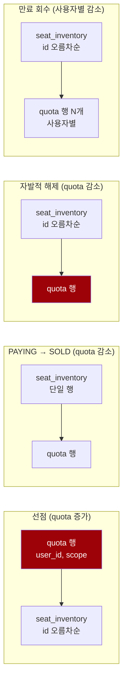

# 실험 — I-12 1인당 좌석 상한의 경쟁 조건 (Task 2G-A)

> TASK-002G-A · 2026-08-16
> 관련: [INVARIANTS.md](../INVARIANTS.md) I-12, [REQUIREMENTS.md](../REQUIREMENTS.md) FR-2.3·FR-2.6·P-2,
> [CLAUDE.md](../../CLAUDE.md) 규칙 1·2·3·8·9·10·11·21·26·30
> 선행: [2C](TASK-002C-multi-seat-atomic-hold.md) · [2D](TASK-002D-seat-expiry-sweeper.md) · [2E](TASK-002E-seat-hold-release.md) · [2F](TASK-002F-transaction-boundary.md)

## 1. 목적과 범위

I-12 를 운영 코드에 넣기 **전에** 경쟁 조건과 트랜잭션·잠금 설계를 실제 MySQL 로 검증한다.

**이번 단계에서 만들지 않은 것:** 운영 마이그레이션, 운영 저장소, 애플리케이션 서비스, REST API, 운영 예외 클래스.
quota 구현은 **테스트 소스에만** 있고(`Task2gQuotaCounter`), 테이블도 `task2g_` 접두사로 운영 이름과 구분한다.

> **왜 지금 운영 스키마를 만들지 않는가.** 범위 키(`event_id` vs `schedule_id`)가 아직 결정되지 않았다(§9).
> 마이그레이션은 적용되면 되돌리기 어렵고, 이 프로젝트는 V1·V2·V3 를 이미 "적용됨, 수정 금지" 로 다룬다.
> 키를 잘못 정한 채 굳히면 그 위에 쌓인 모든 것을 다시 손대야 한다.

### I-12 정의

> 한 사용자는 동시에 **4개(P-2)를 초과하는 활성 선점**을 가질 수 없다.

"활성" 은 `status IN ('HELD','PAYING')` 이다. `SOLD` 는 더 이상 홀드가 아니므로 상한에서 빠진다(2B).

---

## 2. 현재 구조 — 확인한 사실

| 항목 | 사실 | 확인 방법 |
|---|---|---|
| event 모델 | **reservation 쪽에 없다.** `seat_inventory` 는 `schedule_id` 만 가진다 | `event_id`/`eventId` grep 0건 |
| `holdAll(seats, holdId, userId)` | `void` + `SeatUnavailableException`. 호출자 트랜잭션 참여 + NESTED savepoint | 2F |
| `confirm(seatId, holdId, reservationId)` | **좌석 1건씩** 처리 | 시그니처 |
| `releaseAll(holdId, userId)` | `int` — 한 사용자·한 홀드의 실제 해제 수 | 시그니처 |
| `expire(candidates)` | `int` **총합**. `ExpiryCandidate(SeatId, HoldId)` 에 **`held_by` 없음** | 시그니처 |

마지막 줄이 §8 의 핵심 제약이다.

---

## 3. ★ SELECT COUNT 방식의 결정적 실패 재현

### 잘못된 순서

```java
long current = SELECT COUNT(*) FROM seat_inventory
                WHERE held_by = ? AND status IN ('HELD','PAYING');
if (current + requested > 4) reject();     // ← 여기와 아래 사이가 열려 있다
holdAll(seats, holdId, userId);
```

### 재현 조건

- 같은 사용자, 같은 범위
- **서로 겹치지 않는** 3석씩 두 요청
- `CyclicBarrier` 로 "둘 다 COUNT 를 읽은 뒤에 UPDATE 를 시작한다" 를 고정
- `Thread.sleep` 없음

### 결과

```
두 트랜잭션이 관측한 COUNT : [0, 0]      ← 서로의 미커밋 홀드가 보이지 않는다
두 요청 모두 통과           : succeeded = 2
최종 활성 좌석             : 6석          ← ★ I-12 위반 (상한 4석)
```

**왜 좌석 행 잠금이 막지 못하는가.** 두 요청의 좌석 집합이 겹치지 않으므로 행 잠금이 충돌할 일이 없다.
좌석 수준의 정확성(I-8·I-9)은 **사용자 수준 상한과 다른 축**이다. 2C~2F 가 확보한 것으로는 I-12 를 얻을 수 없다.

### 이번 실험이 검증한 범위

| 검증한 것 | 검증하지 않은 것 |
|---|---|
| MySQL 8.4, **기본 REPEATABLE READ** | `SERIALIZABLE` |
| **비잠금 일반 `SELECT COUNT`** | `SELECT ... FOR UPDATE` 같은 locking range read |
| 서로 다른 좌석 행을 갱신하는 두 트랜잭션 | predicate/range lock 의 실제 직렬화 효과 |
| 두 요청 모두 COUNT 0 을 보고 최종 6석 | 상위 격리 수준의 blocking·deadlock·serialization failure 와 재시도 비용 |

**결론은 검증한 범위 안에서만 말한다.** 기본 REPEATABLE READ 의 비잠금 `SELECT COUNT` 는 I-12 를 보장하지 못한다.
더 높은 격리 수준이나 locking range read 로 직렬화할 수 있는지는 **이번 실험의 범위가 아니며 불가능하다고 단정하지 않는다.**
설령 직렬화할 수 있더라도 넓은 범위 잠금과 재시도 비용이 따를 수 있고, 그 비용은 **아직 측정하지 않았다.**

이 프로젝트는 CLAUDE.md 규칙 8("집계로 한도를 검증하지 않는다")에 따라 집계 방식 대신
**카운터 행 조건부 UPDATE** 를 채택한다.

> 이 테스트가 **통과한다는 것은 6석이 만들어지는 것을 관측했다는 뜻**이지 올바른 동작이라는 뜻이 아니다.
> 테스트명과 Javadoc 에 그 취지를 적었다 (규칙 27).

---

## 4. 조건부 카운터 행 실험

검사와 증가를 **한 문장**으로 만든다 (규칙 8).

```sql
UPDATE task2g_user_hold_quota
   SET held_seats = held_seats + :requested
 WHERE user_id        = :userId
   AND quota_scope_id = :scopeId
   AND held_seats + :requested <= 4
```

`affected_rows = 1` → 확보 성공, `0` → 상한 초과. 조건이 WHERE 절 안에 있으므로 **읽고 판단하는 구간이 없다.**

### 검증 결과 (7 tests, 전부 통과)

| 시나리오 | 결과 |
|---|---|
| 같은 사용자 3석 요청 2개 동시 → 정확히 하나만 확보 | 성공 1 / 거부 1 |
| 성공한 요청만 좌석 선점 | 최종 활성 좌석 **3석** |
| 카운터와 실제 활성 좌석 수 일치 | `held_seats == COUNT(활성 좌석)` |
| 1석 보유 상태에서 3석 증가 | 성공, 정확히 **4석** |
| 4석 보유 상태에서 1석 추가 | `affected_rows = 0`, 값 불변 |
| quota 거부 시 좌석 SQL | `status`·`hold_id`·`version` **전부 불변** |
| 서로 다른 사용자 동시 요청 | 각자 3석씩 **둘 다 성공** |

**직렬화 메커니즘.** 진 트랜잭션은 카운터 행의 행 잠금에서 대기했다가, 이긴 쪽이 커밋한 뒤
**갱신된 값으로 조건을 다시 평가**한다. 그래서 `3 + 3 <= 4` 가 거짓이 되어 0건으로 거부된다.
같은 사용자의 요청끼리만 그 행에서 만나므로 **다른 사용자에게는 영향이 없다** — 마지막 줄이 그것을 보인다.

> **테스트 설계에서 배운 것.** 배리어를 잠금 획득 **뒤**에 두면 테스트 자체가 교착한다
> (A 가 행 잠금을 쥔 채 배리어에서 B 를 기다리고, B 는 그 잠금에서 막힌다).
> 처음 작성했을 때 실제로 lock wait timeout 으로 실패했다. 배리어는 `tryAcquire` **직전**에 둬야 한다.

---

## 5. 최초 카운터 행 생성 경쟁

행이 아직 없을 때 동시 요청 두 개가 오면 SELECT 후 INSERT 는 **TOCTOU** 다 — 확인과 삽입 사이가 열려 있어
둘 다 "행이 없다" 를 보고 각자 INSERT 하면 중복 키 경쟁이 된다.

**중복 키 예외를 정상적인 quota 흐름 제어로 쓰지 않는다.** 예외로 분기하면 드라이버·번역기가 그 오류를
어떤 타입으로 올리는지에 계약이 묶이고 호출부마다 그 처리를 반복해야 한다.
행 확보 자체를 원자적으로 만들면 그 분기가 사라진다.

```sql
INSERT INTO task2g_user_hold_quota (user_id, quota_scope_id, held_seats)
VALUES (?, ?, 0)
ON DUPLICATE KEY UPDATE held_seats = held_seats     -- 값을 바꾸지 않는 no-op
```

행이 없으면 만들고, 있으면 그대로 두면서 **그 행의 잠금을 얻는다.** 그 뒤 같은 트랜잭션에서 조건부 UPDATE 를 수행한다.

### 검증 결과 (3 tests, 전부 통과)

| 확인 | 결과 |
|---|---|
| 동시 첫 요청에도 카운터 행은 하나만 | `COUNT = 1` |
| 두 요청이 각각 3석 → 하나만 성공 | 성공 1 / 거부 1 |
| 최종 카운터·좌석 | `held_seats = 3`, 활성 좌석 3석 |
| 중복 키 예외가 흐름 제어로 새어나오는가 | **errors 0건** |

### `INSERT IGNORE` 를 쓰지 않는 이유 — 실측

`held_seats = 99` (CHECK 위반) 를 `INSERT IGNORE` 로 넣어봤다.

```
affected_rows = 0
행 개수       = 0
예외          = 없음
```

**중복 키뿐 아니라 CHECK 위반까지 경고로 낮춰 삼킨다.** 호출자는 "이미 있어서 건너뛴 것" 과
"데이터가 잘못돼서 실패한 것" 을 구분할 수 없다. `ON DUPLICATE KEY UPDATE` 는 중복 키만 다루므로
다른 오류는 그대로 예외가 된다.

---

## 6. 트랜잭션 경계와 quota 롤백

### 검증 결과 (4 tests, 전부 통과)

| 시나리오 | quota | 좌석 |
|---|---|---|
| 전부 성공 후 commit | 3 | 3석 |
| 외부 트랜잭션 rollback | **0** | **0석** |
| **좌석 경합 예외를 경계 밖으로 전파** | **0 — 증가분이 함께 사라진다** | 0석 |
| **좌석 경합 예외를 트랜잭션 안에서 catch** | **3 — 좌석 없이 카운터만 남는다** ⚠ | 0석 |

세 번째 줄이 2F 의 계약이 I-12 에서 실제로 작동함을 보인다. quota 증가와 좌석 선점을
**하나의 최상위 트랜잭션**에 두면 좌석 실패가 카운터까지 되돌린다.

**네 번째 줄은 위험의 재현이다.** savepoint 는 좌석만 되돌린다. 애플리케이션 서비스가
`SeatUnavailableException` 을 트랜잭션 **안에서** 성공으로 삼키면 좌석 없이 카운터만 오른다.
사용자는 4석을 잡은 적이 없는데 예매가 막힌다. §10 의 계약으로 금지해야 한다.

---

## 7. 감소량 — 실제 변경 행 수 기준

### 시나리오 — 두 단계를 거친다 (3 tests, 전부 통과)

공통 사전 상태: 같은 사용자가 **하나의 홀드로 3석**, quota 3. 좌석과 quota 증가는 같은 최상위 트랜잭션에서 커밋.

**1단계 — 선행 만료.** 세 좌석 중 하나의 `expires_at` 만 과거로 민다.
**좌석 상태를 직접 덮어쓰지 않는다** — 회수는 운영 저장소 `JdbcSeatExpiryRepository.expire(...)` 가 수행한다.
회수와 quota 감소는 같은 최상위 트랜잭션에 둔다.

| 관측값 | 결과 |
|---|---|
| 실제 회수된 좌석 | **1** |
| 회수된 좌석의 상태 / `hold_id` / `version` | `AVAILABLE` / `NULL` / **2** (만료 저장소가 올렸다) |
| 1단계 이후 활성 좌석 / quota | **2 / 2** |

**2단계 — 자발적 해제.** 남은 2석을 `releaseAll(...)` 로 해제한다.

| 경로 | `releaseAll` 반환 | 감소 시도 | 감소 결과 | 최종 좌석 | 최종 quota |
|---|---|---|---|---|---|
| **A. 올바른 감소** | 2 | `release(..., 2)` | 성공 | **0석** | **0** |
| **B. 원 요청 수로 감소** | 2 | `release(..., 3)` | **거부 (`affected_rows = 0`)** | **0석** | **2** ⚠ |

**B 는 권장 동작이 아니라 결함 재현이다.** 선행 만료로 quota 는 이미 2 인데 앱이 **원래 요청 좌석 수 3** 으로
줄이려 하면 음수 방어(`held_seats - 3 >= 0`)에 걸려 거부된다. 그 반환값을 확인하지 않고 좌석 해제를
그대로 커밋하면 **좌석 0석 / quota 2** 의 드리프트가 남는다 — 사용자는 좌석을 하나도 갖고 있지 않은데
카운터상 2석을 쓴 것으로 집계된다.

> 이 값들은 가정이 아니라 테스트가 실제로 관측한 값이다.
> 음수 방어가 **드리프트를 막아주지는 않는다.** 카운터가 음수가 되는 것만 막을 뿐,
> 감소 실패를 무시하면 반대 방향(과대 계상)의 드리프트는 그대로 남는다.
> **감소량은 반드시 실제 `affected_rows` 로 계산하고, 감소 자체의 반환값도 확인해야 한다.**

---

## 8. 잠금 순서 분석

### 경로별 접근 순서



**선점은 `quota → seat`, 감소 경로는 `seat → quota`.** 순서가 반대다.

| 경로 | 1순위 | 2순위 |
|---|---|---|
| 선점 + quota 증가 | **quota 행** | `seat_inventory` (id 오름차순) |
| 확정 + quota 감소 | `seat_inventory` | **quota 행** |
| 해제 + quota 감소 | `seat_inventory` (id 오름차순) | **quota 행** |
| 만료 회수 + quota 감소 | `seat_inventory` (id 오름차순) | **quota 행 여러 개** |

### 교착 가능성

같은 사용자·같은 좌석에 대해 선점과 해제가 동시에 진행되면 순환 대기가 성립할 수 있다.

```
TX-A (선점): quota(u) 잠금 → seat(5) 대기
TX-B (해제): seat(5) 잠금 → quota(u) 대기
```

> **이것은 아직 재현하지 않았다.** 구조적으로 가능해 보인다는 것이지 관측된 사실이 아니다.
> 실제 사이클 성립 여부는 Task 2G-B 에서 재현해야 한다 (§13).
>
> *(→ [TASK-002G-B](TASK-002G-B-quota-lock-order.md) 에서 실제 MySQL 데드락(1213/40001)으로
> 재현했고, `quota → seat` 통일 순서를 검증했다. 아래 서술은 TASK-002G-A 시점 기준으로 유지한다.)*

### 통일 가능한 순서 — 후보

**모든 경로에서 `quota 행 → seat_inventory` 로 통일**하는 것이 후보다. 규칙 2 의 "id 오름차순" 은
`seat_inventory` 내부 순서 규칙이므로 그 앞에 quota 행을 두는 것과 충돌하지 않는다.

**그런데 감소 경로에는 제약이 있다.** 감소량은 **실제 `affected_rows` 를 알아야** 계산할 수 있고,
그 값은 좌석 UPDATE 를 실행한 뒤에야 나온다. 즉 "quota 를 먼저 잠그고 나중에 값을 정한다" 가 필요하다.

- `SELECT ... FOR UPDATE` 로 quota 행을 먼저 **잠그기만** 하고
- 좌석 상태 전이를 수행해 `affected_rows` 를 얻은 뒤
- 같은 트랜잭션에서 그 값만큼 감소

이러면 잠금 순서는 통일되고 감소량은 실측값을 쓴다. **다만 이 방식은 아직 측정하지 않았다** —
quota 행 잠금 보유 시간이 좌석 UPDATE 시간만큼 길어지므로 같은 사용자의 동시 요청 처리량에
영향이 있다. Task 2G-B 의 측정 대상이다.

### 만료 스위퍼의 복잡성

만료 회수는 **여러 사용자의 좌석을 한 벌크 UPDATE 로** 처리한다. 그래서 다른 경로와 성질이 다르다.

#### `held_by` 를 추가하는 것만으로는 부족하다

`expire(...)` 는 `int` **총합**만 반환하고 `ExpiryCandidate` 는 `(SeatId, HoldId)` 로 `held_by` 를 담지 않는다.
그래서 "후보에 `held_by` 를 추가하면 사용자별 집계가 된다" 고 생각하기 쉽지만 **그렇지 않다.**

이유는 후보가 **과거 스냅샷**이기 때문이다(2D). 후보 SELECT 와 벌크 UPDATE 사이에 일부 후보가
확정·해제·연장되거나 다른 스위퍼에 먼저 처리되어 stale 해질 수 있고, 최종 UPDATE 는 그 stale 후보를
조건 불일치로 건너뛴다. 그런데 **반환값은 총합 하나뿐이다.**

```
후보: A-1, A-2, B-1, B-2        (사용자 A 2개 / 사용자 B 2개)
그중 하나가 stale               (어느 것인지 반환값에 없다)
벌크 UPDATE affected_rows = 3

후보에 held_by 가 있어도
  A 1석 + B 2석 인지
  A 2석 + B 1석 인지 알 수 없다
```

**따라서 `held_by` 는 필요할 수 있지만 충분조건이 아니다.**
사용자별 quota 감소를 안전하게 연결하려면 **실제로 변경된 좌석을 사용자별로 얻는 구조**가 추가로 필요하며,
현재 `expire(candidates): int` 계약으로는 불가능하다.

#### 후보 대안 (이번 단계에서는 구현하지 않고 비교만)

| # | 방식 | 장점 | 대가 / 미검증 |
|---|---|---|---|
| 1 | 후보를 **(quota scope, user) 로 그룹화**해 그룹별 조건부 UPDATE 실행 → 그룹별 `affected_rows` 획득 | 각 그룹의 실제 회수 수가 바로 나온다. 회수 SQL 의 조건은 그대로 | 한 배치가 그룹 수만큼의 UPDATE 로 쪼개진다. 왕복·잠금 시간 증가는 미측정 |
| 2 | **만료 저장소 계약 재설계** — 실제 변경된 좌석과 사용자를 반환 | 호출자가 정확한 감소량을 얻는다 | MySQL 은 `UPDATE ... RETURNING` 을 지원하지 않는다. 갱신 후 재조회하거나 후보를 먼저 잠그는 방식이 필요하고, 둘 다 추가 왕복과 잠금 비용이 든다 |
| 3 | quota 행과 후보 좌석을 **결정적 순서로 잠근 뒤** 사용자별 처리 | 잠금 순서 통일과 함께 해결된다 | 잠금 보유 구간이 길어진다. 스위퍼가 사용자 요청 경로와 경합할 때의 영향 미측정 |
| 4 | **사용자별 트랜잭션 분리** | quota 잠금 범위가 좁다. I-10·I-11 은 각 좌석의 조건부 UPDATE 가 보장하므로 나눠도 깨지지 않는다(회수는 전부-또는-전무가 아니다) | 배치당 트랜잭션·왕복이 늘어 처리량이 떨어진다. 미측정 |

> **`UPDATE ... RETURNING` 을 해결책으로 단정하지 않는다.** MySQL 8.4 는 이 구문을 지원하지 않는다.

**실제 전략은 Task 2G-B 의 실험 대상으로 남긴다.** 지금 `ExpiryCandidate` 운영 코드를 바꾸지 않는다.

#### 그 밖의 제약

1. **여러 quota 행을 잠그게 된다.** 한 배치에 N 명의 사용자가 섞이면 quota 행 N 개를 잠근다.
   그 순서도 규칙 2 처럼 **정렬해야** 교착을 피할 수 있다(예: `user_id` 오름차순).
2. **사용자별로 트랜잭션을 나눌 것인가.** 나누면 quota 잠금 범위가 좁아지지만,
   한 배치가 여러 트랜잭션으로 쪼개진다. I-10(만료 회수)·I-11(확정 보호)은 각 좌석의
   조건부 UPDATE 가 보장하므로 **트랜잭션을 나눠도 깨지지 않는다** — 회수는 전부-또는-전무가 아니기 때문이다(2D·2E 와 같은 성질).
   대신 배치당 왕복이 늘어 처리량이 떨어진다. **이 트레이드오프는 측정하지 않았다.**

---

## 9. 범위 키 — `event_id` vs `schedule_id` (미결정)

### 사실

- INVARIANTS.md 예시는 `user_hold_quota(user_id, event_id)` 를 쓴다.
- **그런데 reservation 쪽에 event 모델이 없다.** `seat_inventory` 는 `schedule_id` 만 가진다.
- `REQUIREMENTS.md` 는 P-2 를 "1인당 동시 선점 좌석 수 4석" 이라고만 적고 **범위를 명시하지 않는다.**

### 두 해석의 의미가 다르다

| 키 | 의미 | 결과 |
|---|---|---|
| `event_id` | **명절 예매 이벤트 전체** 상한 | 사용자는 이벤트 전체에서 4석. 여러 열차에 걸쳐 합산된다 |
| `schedule_id` | **열차 운행편별** 상한 | 편마다 4석. 100편이면 최대 400석을 잡을 수 있다 |

**`schedule_id` 로 두면 사재기 방지 목적이 사실상 무력해진다.** 매크로가 편을 바꿔가며 잡으면 된다.
P-2 의 취지(명절 예매 사재기 방지)를 고려하면 **`event_id` 계열 범위가 맞다.**

### 현재 요구사항만으로 확정 가능한가

**불가능하다.** 다음이 정해지지 않았다.

- 이벤트 단위가 무엇인가 (판매 회차? 명절 단위? 노선 묶음?)
- 한 이벤트에 여러 `schedule` 이 속하는가 (`train_schedule.sale_event_id` 가 설계안에 있으나 스키마에 없다)
- 왕복 예매처럼 서로 다른 편을 함께 잡는 것을 4석 안에서 허용하는가

### 권장안

> **`quota_scope_id` 를 `event_id` 의미로 두되, event 모델을 먼저 도입한다.**

- 실험에서는 중립적인 `quota_scope_id` 를 쓴다 (이번 Task 에서 그렇게 했다).
- 운영 마이그레이션 전에 **`train_schedule` 과 판매 이벤트의 관계를 먼저 정의**해야 한다.
- 그 전까지 `schedule_id` 를 편의상 대입하면, 나중에 키를 바꿀 때 **이미 쌓인 카운터 데이터의 의미가 달라져** 마이그레이션이 어려워진다.

**→ 사용자/정책 결정이 필요하다.** 이 결정 없이 운영 스키마를 만들지 않는다.

---

## 10. 예외와 API 의미 — 후보 계약 (구현 안 함)

이번 단계에서 운영 예외 클래스를 추가하지 않았다. 계약만 정리한다.

| 항목 | 후보 |
|---|---|
| 예외 | `QuotaExceededException` — **예상 가능한 도메인 실패** |
| 성격 | 오류가 아니다. 상한에 걸린 정상 동작 (규칙 21 과 같은 성격) |
| HTTP | 앱/API 계층이 **429 QUOTA_EXCEEDED** 로 매핑. `Retry-After` 는 의미가 없으므로 재검토 필요 |
| 소유 | **도메인 예외가 HTTP 상태를 직접 소유하지 않는다** (2F 에서 같은 판단을 했다) |
| 순서 | quota 초과 시 **좌석 SQL 을 실행하지 않는다** — §4 에서 검증했다 |
| 롤백 | `SeatUnavailableException` 이 나면 quota 증가도 **같은 최상위 트랜잭션에서 롤백** — §6 |

### ⚠ 금지 계약

**애플리케이션 서비스는 `SeatUnavailableException` 을 트랜잭션 안에서 잡아 성공으로 처리하면 안 된다.**
§6 의 네 번째 줄이 그 결과를 보인다 — 좌석 없이 카운터만 3 으로 남는다.

예외는 **트랜잭션 경계 밖**으로 전파해 거기서 409 로 매핑한다.
만약 트랜잭션 안에서 잡아야 할 이유가 생기면 **명시적 보상(quota 감소)이 같은 트랜잭션에 있어야 한다.**

---

## 11. 검증된 사실과 아직 검증하지 않은 가정

### 검증된 것 (실제 MySQL 8.4 Testcontainers, 18 tests)

- 집계 방식은 같은 사용자의 동시 3석 요청 2개에서 **6석을 허용한다** (결정적)
- 카운터 행 조건부 UPDATE 는 같은 사용자 요청을 직렬화해 **하나만 통과시킨다**
- 다른 사용자는 서로 영향을 주지 않는다
- `INSERT ... ON DUPLICATE KEY UPDATE` 로 최초 행 경쟁이 원자화된다 (행 1개, 성공 1건)
- `INSERT IGNORE` 는 CHECK 위반까지 삼킨다 (실측)
- quota 증가와 좌석 선점을 한 트랜잭션에 두면 좌석 실패가 quota 도 되돌린다
- 예외를 트랜잭션 안에서 잡으면 quota 만 남는다 (위험 재현)
- 선행 만료 1석 회수 후 `releaseAll` 이 **2** 를 반환하고, 그 값으로 감소하면 좌석 0석 / quota 0 으로 일치한다
- 같은 상황에서 원 요청 수(3)로 감소하면 음수 방어에 걸려 **거부**되고, 그 실패를 무시하면 **좌석 0석 / quota 2 의 드리프트**가 남는다

### 아직 검증하지 않은 것

- **선점(quota→seat)과 해제(seat→quota)의 실제 데드락 사이클** — 구조적으로 가능해 보이나 재현하지 않았다
- **`SELECT ... FOR UPDATE` 로 quota 를 선점하는 방식의 처리량 영향** — 측정 없음
- **만료 스위퍼를 사용자별 트랜잭션으로 나눌 때의 처리량** — 측정 없음
- **만료 배치에서 사용자별 실제 회수 수를 얻는 방법** — §8 의 후보 1~4 중 어느 것도 측정하지 않았다. 여러 사용자·partial stale 이 섞인 시나리오 자체를 아직 만들지 않았다
- **카운터 드리프트 복구** — 어느 경로가 감소를 빠뜨리거나 감소 실패를 무시하면 카운터가 실제와 어긋난다. 정합성 검사 쿼리와 보정 수단이 없다
- **`held_seats` 와 실제 활성 좌석의 대사(reconciliation)** — 단일 시나리오에서만 일치를 확인했다
- 카운터 행 잠금이 인기 사용자(매크로)에게 미치는 영향

> 동시성 결과는 증명이 아니다. 이 환경과 실행 횟수에서 관측된 것이며(규칙 30),
> 핵심 근거는 배리어로 순서를 고정한 **결정적 테스트**다.

---

## 12. 이번 단계에서 운영 마이그레이션을 만들지 않은 이유

1. **범위 키가 미결정이다** (§9). 잘못 굳히면 데이터 의미가 달라져 되돌리기 어렵다.
2. **잠금 순서 통일안이 아직 후보 단계다** (§8). 스키마보다 접근 순서가 먼저 정해져야 한다.
3. **만료 경로에서 사용자별 실제 회수 수를 제공하는 저장소 계약 결정이 선행되어야 한다** (§8).
   `ExpiryCandidate` 의 `held_by` 추가나 반환 타입 변경 여부는 **그 계약이 확정된 뒤** 판단한다.
4. 이 프로젝트는 V1·V2·V3 를 "적용됨, 수정 금지" 로 다룬다. 마이그레이션 추가는 사실상 되돌릴 수 없는 결정이다.

---

## 13. Task 2G-B 권장 범위

우선순위 순.

1. **범위 키 결정** — event 모델 도입 여부와 `train_schedule` 관계 정의. **사용자/정책 결정 필요.**
2. **만료 경로의 저장소 계약 결정** — **`held_by` 추가부터 하지 않는다.** 순서는 이렇다.
   1. 여러 사용자와 **partial stale 후보**가 섞인 결정적 테스트를 먼저 만든다.
   2. 그 테스트로 "사용자별 실제 `affected_rows` 를 어떻게 얻을 것인가" 를 결정한다 (§8 의 후보 1~4 비교).
   3. 계약이 정해진 뒤에만 `ExpiryCandidate` 또는 반환 타입을 바꾼다.

   **Task 2G-B 에 필요한 결정적 테스트 시나리오**
   - 사용자 A 와 B 의 만료 후보가 **한 배치**에 포함된다
   - 각 사용자의 후보 수가 **서로 다르다**
   - 한 사용자 쪽에 **stale 후보**가 섞인다 (후보 SELECT 이후 확정·해제·연장)
   - 실제 회수 수와 **사용자별 quota 감소량이 정확히 일치**한다
   - **stale 후보를 가진 사용자의 quota 를 과대 감소하지 않는다**
3. **데드락 재현 테스트** — 선점(quota→seat)과 해제(seat→quota)를 배리어로 교차시켜 사이클이 실제로 성립하는지 관측한다. 성립하면 잠금 순서 통일이 필수 근거를 얻는다.
4. **잠금 순서 통일안 확정** — `quota → seat` 로 통일하고, 감소 경로는 `SELECT ... FOR UPDATE` 로 quota 를 먼저 잠근 뒤 `affected_rows` 로 감소.
5. **운영 스키마·저장소** — 1~4 가 끝난 뒤. `user_hold_quota` 마이그레이션 + `JdbcUserHoldQuotaRepository`.
6. **애플리케이션 서비스** — 트랜잭션 경계 소유. `QuotaExceededException` 도입과 429 매핑은 API 계층 Task 로.
7. **정합성 검사 쿼리** — `held_seats` 와 실제 활성 좌석 수가 어긋난 사용자를 찾는 쿼리를 `load-test/verify/` 에 추가.

---

## 14. 남은 위험

| 항목 | 내용 |
|---|---|
| **범위 키 미결정** | `schedule_id` 로 두면 사재기 방지가 무력해진다. event 모델 도입 전에는 운영 스키마를 만들 수 없다 |
| **데드락 미재현** | 선점과 감소 경로의 순서가 반대다. 사이클 성립 여부를 아직 관측하지 않았다 |
| **트랜잭션 내부 catch 위험** | 앱 서비스가 좌석 경합 예외를 삼키면 좌석 없이 카운터만 오른다. 저장소가 막을 수 없다 |
| **카운터 드리프트** | 어느 감소 경로 하나가 빠지면 사용자가 영구히 예매 불가. 검사·보정 수단이 없다 |
| **만료 경로 반환 구조** | `held_by` 를 추가해도 **부족하다.** 후보가 스냅샷이라 어느 사용자의 후보가 실제로 회수됐는지 총합만으로는 알 수 없다 |
| **감소 실패를 무시하는 코드** | 음수 방어는 카운터가 음수가 되는 것만 막는다. 감소 반환값을 확인하지 않으면 과대 계상 드리프트가 남는다 (§7 B) |
| **quota 행 잠금 보유 시간** | 감소 경로에서 좌석 UPDATE 동안 quota 행을 쥐게 된다. 측정하지 않았다 |
| **4석 상한의 정책 한계** | REQUIREMENTS.md 가 이미 기록한 대로 5인 가족을 배제한다. 이 프로젝트 범위 밖 |

---

## 15. 재현 명령

```bash
./gradlew :modules:reservation-infra:test --tests "*UserHoldQuotaRaceReproductionTest"
```

Docker 가 실행 중이어야 한다. 테스트 전용 테이블 `task2g_user_hold_quota` 는 테스트가 직접 만든다
(운영 마이그레이션 없음).
